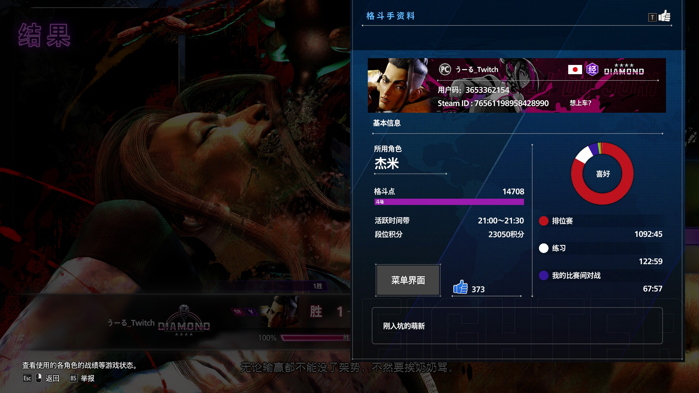
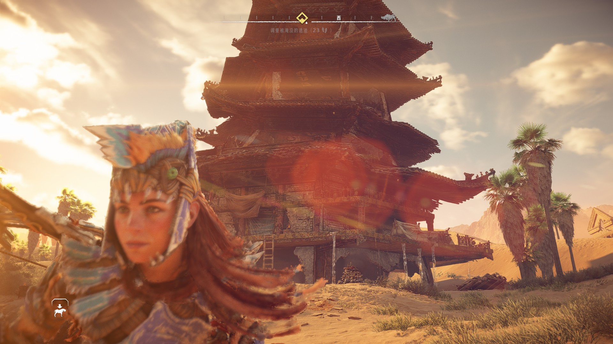
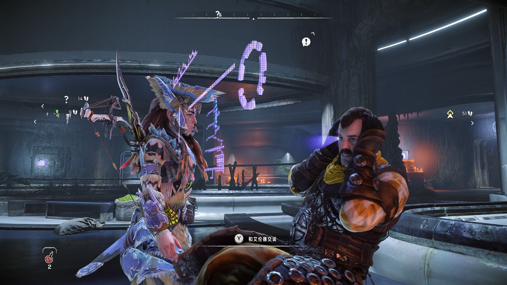

********************************************************************************************************************

苍穹外卖{
    菜品全部功能也写完了

    现在在搞Redis 下了个管理redis的可视化图形界面工具 Redis Desktop Manager

    在项目里用redis的话是用springdata redis的依赖来引入的，外卖把基础的redis学一下，后面点评应该有高级技巧
}

********************************************************************************************************************

Langchain{
    开了ai的坑，慢慢学吧 后面有个三个月的项目要用到的

    了解到ollama是一个基于docker的ai模型管理工具，可以在本地运行ai模型，也可以在云端运行ai模型

    本地部署模型有高客制化特性，但是需要自己维护。云端模型则需要支付费用（所以我用ds的key接入的是云端的模型吗） 还是说用key接的也可以客制化？
}

********************************************************************************************************************

数据结构{
    没听课，其实是老师都没怎么讲（笑了） 课上批作业

    有空把那个用c写的算法看看理解一下
}

********************************************************************************************************************

补课{
    转专业的课要补三门好像：c 艺术导论 线性代数

    c 和 线性代数 就tm没开课把我当日本人整呢，唯一开了的艺术导论还因为26.8学分上限选不了
}

********************************************************************************************************************

MySQL{
    讲了建表语句和数据类型

    竟然不画图了
}

********************************************************************************************************************

数字逻辑{
    不是自习课？

    困爆 自习课嗜睡甚是惭愧
}

********************************************************************************************************************

还在地平线。街霸算是打破防了，不知道是立回还是防守对策的问题，闲了找几个正分请教一下吧（群里竟然没有杰米大手子 大失所望doge）。鸣潮还有七天更新，依旧最尊重演出之二游，依旧比比尬文戏，管他的情绪铺垫后cg做的够好就完事了；巫师三巫师三巫师三巫师三快重制了欧耶~

********************************************************************************************************************