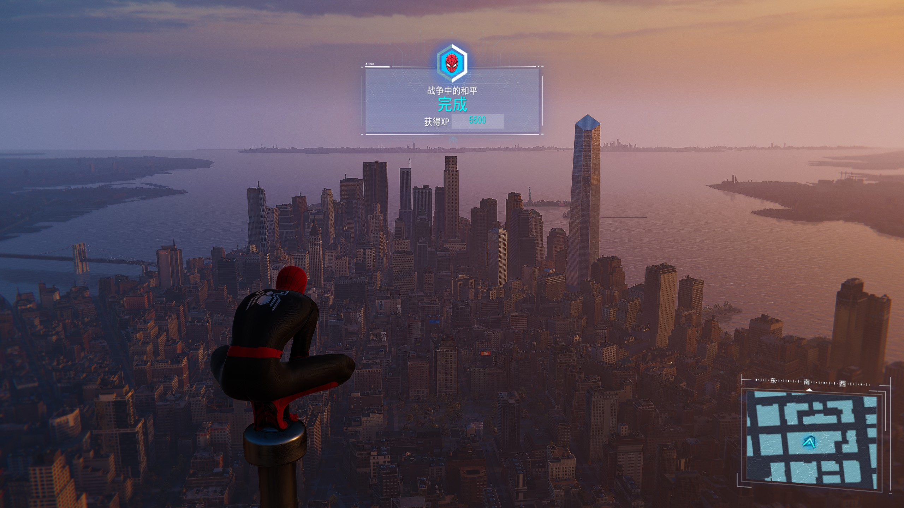
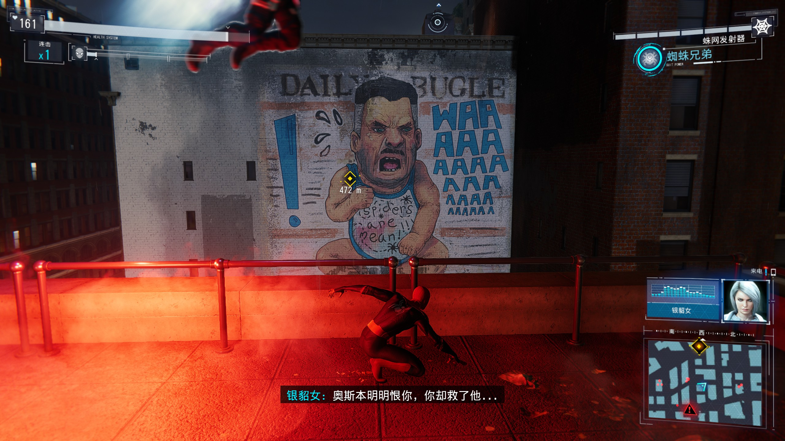

********************************************************************************************************************

苍穹外卖{
    service接口的实现写完了，也就是员工分类管理那部分，现在在写菜品分类，都差不多

    涉及的基础知识点很多，web跳的有点多听蒙了，有时间再补吧 理解为主
}

********************************************************************************************************************

Langchain{
    开了ai的坑，慢慢学吧 后面有个三个月的项目要用到的

    看到ollama 小羊驼怪可爱的
}

********************************************************************************************************************

数据结构{
    依旧天书，依旧老师自己讲自己的，依旧伪代码，依旧通篇理论

    沟槽的看网课慢慢理解吧 顺便把基础的c学了
}

********************************************************************************************************************

补课{
    转专业的课要补三门好像：c 艺术导论 线性代数

    c 和 线性代数 就tm没开课把我当日本人整呢，唯一开了的艺术导论还因为26.8学分上限选不了
}

********************************************************************************************************************

MySQL{
    依旧E-R图，画图大王说是
}

********************************************************************************************************************

数字逻辑{
    不是自习课？
}

********************************************************************************************************************

通关了蜘蛛侠1，等迈尔斯打折吧。九月底还有巫师三重制 十月还有影之刃零 ，填完西之绝境的坑就接上巫师三不要太爽。其他小坑看心情

我还以为能选呢，梅姨都给我整没了索尼你也是个狼灭。 流程很短，演出不错，虽然罐头但管他的他可是失败的曼口牙！
********************************************************************************************************************