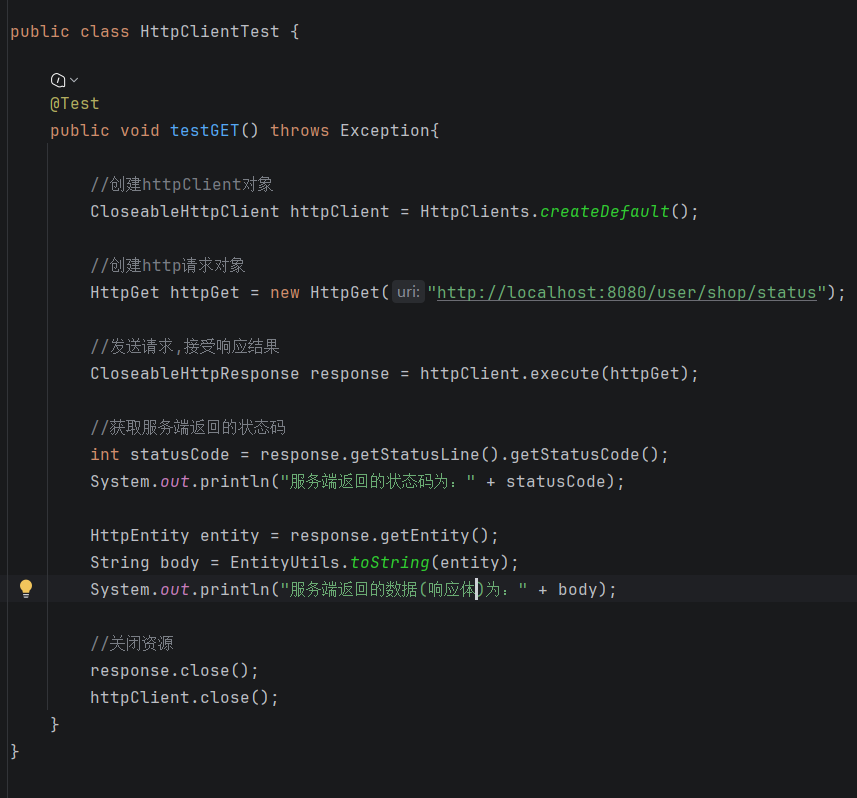

工具类有相关API，问ai就好。 要知道有这个东西能用，想到就问ai或者去官方看文档

HttpClient 
是一个用于发送 HTTP 请求的工具，它提供了简单而强大的功能来处理 HTTP 请求和响应。{

  // 1. 打开浏览器
CloseableHttpClient httpClient = HttpClients.createDefault();

// 2. 输入网址（GET 的参数用 URIBuilder 拼到 URL 上）
URIBuilder builder = new URIBuilder(url);
builder.addParameter("name", "zhangsan");
HttpGet httpGet = new HttpGet(builder.build());

// 3. 回车
CloseableHttpResponse response = httpClient.execute(httpGet);

// 4. 看结果：状态码 + 响应体，最后关资源
if (response.getStatusLine().getStatusCode() == 200) {
    String result = EntityUtils.toString(response.getEntity(), "UTF-8");
}
response.close();
httpClient.close();

}

